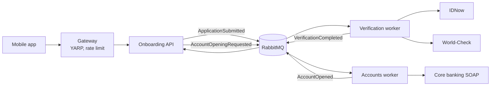

# Atlas onboarding

The backend for the mobile onboarding flow: the app sends `POST /applications`, we check the person with IDNow
(document + selfie) and World-Check (sanctions/PEP) and answer in the same call. When it's approved we also open the
current account in core banking in the background.

It's a few small .NET 10 services behind a gateway, talking over RabbitMQ, each with its own SQL Server database.
The external providers (IDNow, World-Check, core banking) are stand-ins in `src/Stubs`, so everything runs locally.

## Run it

You need the .NET 10 SDK and Docker. Nothing else, no certificates, and **no Aspire install**: Aspire comes in as
NuGet packages with the first `dotnet run` (the Windows versions too), there's no workload or CLI to set up.

I built and ran it on macOS only, **I didn't test it on Windows**. There are no shell scripts and nothing Mac specific
in it (just `docker compose` and `dotnet`), so it should work, but if something breaks there that's probably why.
**If you have any problem at all running it on Windows, please let me know and I'll help you get it set up.** For the
presentation I'll use my MacBook anyway.

```
docker compose up -d                  # SQL Server, RabbitMQ, Seq, Azurite, Redis
dotnet run --project src/AppHost      # all services, plus the Aspire dashboard
```

The dashboard opens in the browser (the login link is also printed in the console). Then open
`requests/atlas.http` (VS Code REST Client or Rider/Visual Studio) and send requests from top to bottom. Every
scenario is in there with what to expect.

Ports and passwords are all in `.env` (committed on purpose, they are throwaway local values). If 1433 or another
port is taken on your machine, change it there once, compose and the services both read it. Personal overrides go in
`.env.local` (git-ignored).

| What | Where |
|---|---|
| Public API (gateway), what mobile calls | http://localhost:5070 |
| Aspire dashboard (traces, logs, metrics) | http://localhost:15263 |
| Seq (logs) | http://localhost:5341 |
| RabbitMQ management | http://localhost:15672 (atlas / atlas_local_dev) |
| Onboarding API directly, Swagger UI | http://localhost:5162/swagger |
| Provider stand-ins | http://localhost:5090 |

## Tests

```
dotnet test
```

Runs everything: the unit tests (domain rules, around 90) and the integration tests (about 30 seconds). The
integration tests start the real AppHost against the real SQL Server and RabbitMQ from docker compose, and call the
gateway like the app does. No in-memory fakes, only the providers are the stand-ins.

They run as a separate copy of the system on the same containers: own databases (`atlas_*_tests`) and own RabbitMQ
virtual host, so they don't touch your dev data and you can even run them while the dev stack is up. The data
stays after a run so you can look at it. A few switches:

- `ATLAS_TEST_RESET=true` drops the test databases first, the migrations build them again from empty
- `ATLAS_TEST_INSTANCE=dev` runs them against the normal dev setup instead (stop the dev stack first then)

What they cover: the three required cases (slow provider, possible match, submitted twice, including the same
request five times at once), a core banking timeout that must end with exactly one account, and a worker stopped in
the middle of a call. The QA notes go through all scenarios: [docs/qa-notes.md](docs/qa-notes.md).

## What's in it



- **Gateway** (`src/Gateway`): the only thing reachable from outside. Maps `POST /applications` to the versioned API,
  rate limits submissions (10 a minute per address, counted in Redis), rejects bodies over 28 MB.
- **Onboarding** (`src/Onboarding.*`): validates the application per market, stores it with the images in blob storage,
  and waits up to 10 seconds for the decision so mobile gets one call and one answer. Slower than that it answers
  202 and the app checks `GET /applications/{id}`. Idempotency-Key header + unique indexes so a retry never makes a
  second application.
- **Verification** (`src/Verification.*`): calls both providers at the same time and decides: approved, rejected, or
  referred to a compliance officer on a possible match.
- **Accounts** (`src/Accounts.*`): opens the account in core banking. This is the tricky one, core banking has no
  idempotency, a timeout doesn't mean it failed, max 5 calls per market shared with the branches, closed at night.
  So it never calls OpenAccount again blindly, it looks the account up instead, and escalates to operations when it
  can't know.
- **BuildingBlocks**: shared plumbing only (messaging with outbox/inbox, migrations, document storage). No business
  logic in there.

Each service is split in Domain / Application / Infrastructure / host, the business rules are in Domain and have
unit tests.

Why things are the way they are is in [docs/decisions.md](docs/decisions.md).

## What I built and what I left out

Built: the mandatory path end to end, all six markets (identifier checks per market, MD needs a branch visit, MF
accepts passports), and account opening (that was optional). Plus the stuff around it: outbox/inbox, rate limiting,
graceful shutdown, several copies of each service, OpenTelemetry to the dashboard and Seq.

Left out, on purpose:

- **The compliance officer review.** Compliance says a possible match must be reviewed by a person, the ticket says
  no human review in v1. So a referral stops at `REFERRED` and nothing moves it on. How I'd add it is in
  docs/decisions.md.
- **Card ordering.** It's in the ticket's flow but there is no card system described anywhere.
- **Authentication.** The API is anonymous like the ticket's sketch, that's an open question (it also makes the rate
  limit per IP only).
- **Real providers, deployment.** No Dockerfiles or Kubernetes manifests. It would run on AKS with Azure SQL and
  Service Bus, that's a config change for MassTransit and the connection strings, not a code change.
- **Telling ops about escalations.** Accounts publishes `AccountOpeningEscalated` but nobody consumes it yet.

## Handy switches

- `dotnet run --project src/AppHost -- --Atlas:Replicas=3` runs 3 copies of the API and the workers, to see them
  share the work (section 9 in `atlas.http`)
- `dotnet run --project src/AppHost -- --Atlas:Instance=demo` runs a separate copy with its own databases, add
  `--Atlas:ResetInstance=true` to start it empty
- `Gateway__RateLimiting__Enabled=false` turns the rate limit off
- After 22:00 market time core banking is closed (that's the real rule). To try account opening at night set
  `Accounts__Opening__ObserveEndOfDayWindow=false` and `Stubs__CoreBanking__EnforceEndOfDay=false`

## How I built it

- **Claude Code** for agentic coding. Mostly Opus for planning and the design decisions, Sonnet and Haiku for
  implementing the plans. I went through and can explain everything in here, the reasoning behind each call is in
  docs/decisions.md.
- **macOS** for development, **Rider** as IDE.
- **.NET Aspire** as the local orchestrator: the AppHost (`src/AppHost`) starts all services, wires their connection
  strings and gives the dashboard with traces and logs. The infrastructure itself (SQL Server, RabbitMQ, Seq, Azurite,
  Redis) stays in docker compose, so Aspire only runs our own code.

### What I'd do differently

There's no `AGENTS.md` (or `CLAUDE.md`) and no skills in the repo, and that's the first thing I'd add if I started
again, and keep adding to along the way. Right now the conventions live in my prompts and in my head, so I kept
repeating them to the agent. In the repo they'd help every session from the start:

- **How we write .NET here**: formatting (on top of `.editorconfig`), naming, the layering rules (Domain has no
  infrastructure, BuildingBlocks has no business logic), how comments are written, run `dotnet test` before saying
  something's done.
- **The business rules**: the markets and their identifiers, what core banking can and can't do (no idempotency, a
  timeout isn't a failure, the night window), Compliance's rules. So the agent checks a change against them instead of
  me catching it in review.
- **Skills for the repetitive bits**: adding an EF migration, a new message with its consumer, a new stub scenario.

## MediatR and MassTransit

**MediatR** runs the Onboarding API's commands and queries (submit, record a verdict, get the status) through one
pipeline, with logging as a behaviour around every handler. Honestly, for a service this size it's probably overkill,
the endpoints could call the handlers directly. I kept it to show how I'd structure a bigger service: one handler per
use case, and cross-cutting things (logging, later validation or transactions) in one place instead of in every
handler. The two workers have one entry point each (the message consumer), so there they call their handlers directly.

**MassTransit** is the one that really pays off. The transactional outbox and inbox with EF Core come out of the box: a
message is saved in the same transaction as the data it's about and only sent after the commit, and a consumed
message is recorded so a redelivery doesn't do the work twice. Writing that by hand is a lot of fiddly code that's easy
to get wrong. On top of that: retries, error queues, the broadcast to every instance, OpenTelemetry, and moving from
RabbitMQ to Azure Service Bus is a change to the transport line, not to the code.

The catch is the licence. MassTransit 9 (and MediatR 13) moved to a commercial licence, so both are pinned to the last
open source versions (MassTransit 8.5, MediatR 12.5). For a new production system today I'd weigh the licence cost
against the alternatives (or the cloud provider's own SDK with a hand-written outbox), but as it is it's very useful,
and for this it does exactly what's needed.

## Changes to the provided platform

- Seq from the provided compose crashed on first start (it wants an admin password now), I added
  `SEQ_FIRSTRUN_NOAUTHENTICATION: "true"`.
- Added RabbitMQ, Azurite and Redis (all from the allowed list).
- Ports and passwords moved to the root `.env`, the root `compose.yaml` just includes `platform/docker-compose.yml`.

## Things you might notice

- At startup the AppHost logs two `crit` lines about a Kubernetes watch timing out. That's Aspire's orchestrator, we
  don't declare any containers in the AppHost (infra comes from compose). Harmless.
- The dashboard's Stop button gives up after about 12 seconds. A worker that's finishing a long call keeps going
  anyway and stops when it's done, the dashboard just reports it wrong.
